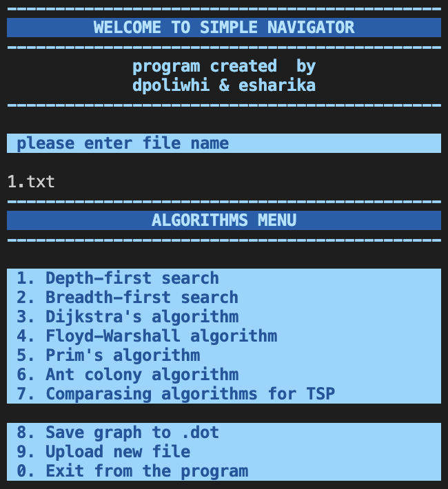
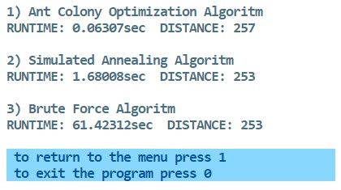

# **Simple Navigator**

## Описание программы
Программа Simple Navigator реализует основные алгоритмы работы с Графами  
Программа выполнена на языке программирования С++ с применеием ООП, архитектурных паттернов и паттернов проектирования.

## Реализация архитектуры программы

Общая архитектура программы построена на основе паттерна **MVC**, имеет консольный интерфейс, который расположен в директории Interface.   Основные алгоритмы расположены в директории Model, вспомогательные классы (Матрицы, контейнеры) расположены в одноименных директориях.  

## Графы
Файлы с графами расположены в директории *datasets* и представленны в виде *.txt* файлов с матрицами смежности  
Также приложение позволяет конвертировать *.txt* файл в *.dot* файл (пункт 8 основного меню консольного интерфейса)  
Для просмотра графа требуется установить соответствующее расширение используюемую IDE (Graphviz для VS Code)

## Алгоритмы

1. **Обход графа в глубину и в ширину:** необходимо задать начальный город и аогоритм посчитает кратчайший путь до последнего города и покажет путь  
2. **Поиск кратчайшего пути между двумя вершинами в графе** с использованием *алгоритма Дейкстры*: алгоритм принимает на вход номера двух вершин и возвращает численный результат, равный наименьшему расстоянию между ними  
3. **Поиск кратчайших путей между всеми парами вершин в графе** с использованием *алгоритма Флойда-Уоршелла*: в качестве результата алгоритм возвращает матрицу кратчайших путей между всеми вершинами графа  
4. **Поиск наименьшего остовного дерева в графе** с помощью *алгоритма Прима*: в качестве результата алгоритм должна возвращать матрицу смежности для минимального остовного дерева  
5. **Задача коммивояжера**: решение задачи TSP муравьинным алгоритмом (*ACO - Ant Colony Optimization*)   Алгоритм выдаст наиболее близкий к минимальному значению результат длинны маршрута.   Отличительная особенность алгоритма - высочайщая скорость и максимальная преближенность к реальной жизнию   Объектно-ориентированный подход позволяет повторить жизнь муравьинной колонии, воспроизвезти их походы за едой по тропам, выбор пути согласно феромонам, оставленным на тропе.  
6. Реализация сравнения алгоритмов решения **Задачи коммивояжера**: *муравьинный алгоритм*, описанный выше, алгоритм *симуляции отжига* (*SA - Simulated Annealing*) и алгоритм *полного перебора* (*BruteForce*).   В данном пункте можно отследить скорость работы данных алгоритмов на тех или инных графах, увидеть их точность. 

********* 

## Makefile и Unit-тесты
В корневой дирректории расположен Makefile со следующими целями:

* **make all** - запускает приложение 
* **test** - запускает **Unit-тесты** на основе библиотеки GTest, проверку парсинга .txt файла, проверку результата каждого алгоритма поиска путей в графе, проверку результата решения задачи TSP.  
* check - запускает проверку всех файлов на стилевые нормы, утечки и **cppcheck**
* clean - выполняет полную очистку файлов установки и удаленние всех данных приложения
